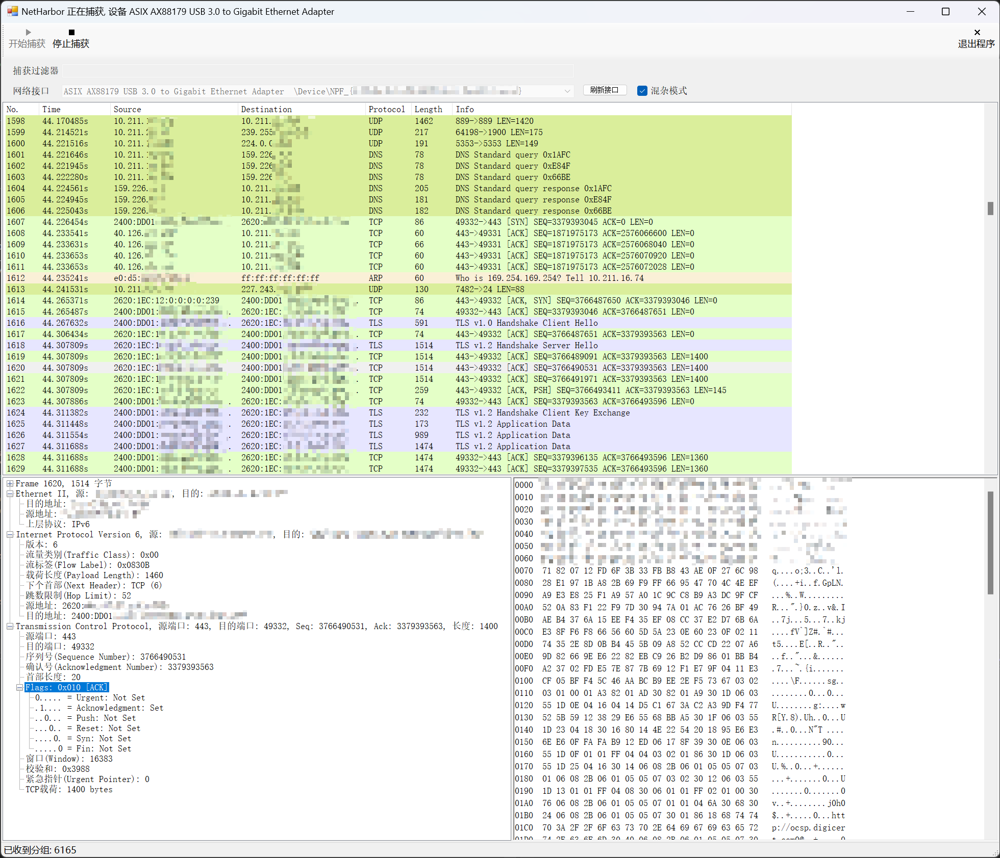

# NetHarbor

2023秋网络攻防基础实验1A - 网络嗅探器设计与实现

实验要求设计一个网络嗅探器，要求实现网络嗅探功能，并尽量完善网络分析功能。开发工具使用Visual Studio 2022，整体基于C#语言和.NET Framework开发，图形界面基于WinForm技术，捕获网络流量使用了Npcap（开启Winpcap兼容模式）提供的API。

本软件提供了网络接口获取、捕获过滤器和网络流量捕获与捕获分组数统计功能，支持对Ethernet帧、ARP协议、IPv4/IPv6协议、ICMP/ICMPv6协议、TCP协议、UDP协议以及TLS协议、HTTP协议和DNS协议数据包的简单解析。

# 代码结构&主界面

NetHarbor为主目录，MainForm.cs有GUI处理相关、包嗅探与控制相关代码以及包粗粒度处理解析线程相关代码。

NetHarbor.PacketParser为解析相关代码，RoughParser.cs和DetailedParser.cs分别为粗粒度包解析器和细粒度包解析器；PacketWrapper.cs是数据包包装类，用于封装存储与数据包相关的内容。Protocol.cs和ProtocolHeader.cs分别为协议与协议详细内容枚举类和协议首部结构体类，其中存放了与协议定义有关的内容，方便解析器使用。HeuristicJudger.cs存放了启发式解析规则判断的相关内容。Tools.cs包含与网络数据包处理相关的工具类，如大端序转小端序、二进制数据转IP字符串&MAC字符串、从指针中拷贝定长数据等功能。

软件主界面如图所示。

其余内容参见报告。
